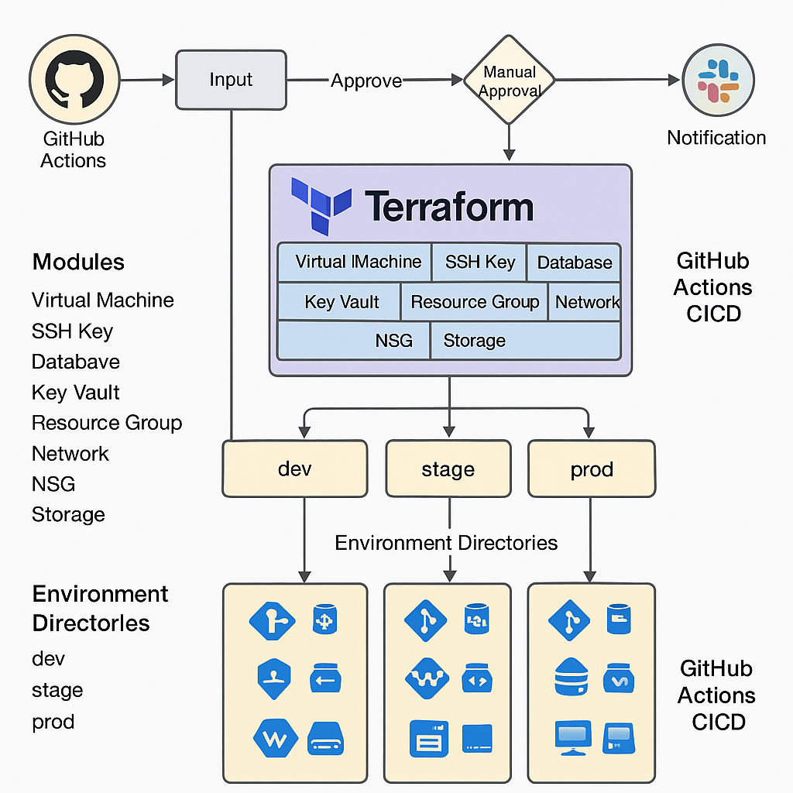

# 🌐 Terraform Azure Infrastructure with GitHub Actions CI/CD

## 📟 Project Overview

This project automates the provisioning of Azure infrastructure using **Terraform** modules, executed through **GitHub Actions** CI/CD pipelines. It supports **multi-environment deployments** (`dev`, `stage`, and `prod`) with isolated backends and reusable modules.

Key features:

- Infrastructure-as-Code with **Terraform modules**
- **GitHub Actions** for deployment automation
- **Environment-specific directories** with separate backends
- Slack alerts and **manual approval gates**
- Runtime selection: choose environment and destroy/apply action interactively

---

## ✅ Advantages

- **Reusable Modules**: Clean separation and reuse across environments
- **Environment Isolation**: Dev, Stage, Prod have separate state backends
- **Automated CI/CD**: GitHub Actions ensures consistent, auditable deployments
- **Security & Secrets**: Uses Azure Key Vault and GitHub Secrets securely
- **Observability**: Slack notifications and manual approvals enhance control and visibility
- **Scalability**: Easily extend infrastructure by updating or adding modules

---

## 📦 Module Structure & Explanation

Each Terraform module is purpose-built for a specific Azure resource:

### 1. `resource_group` Module
Creates Azure Resource Groups for each environment. All other resources are nested under this.

### 2. `network` Module
Provisions Virtual Networks (VNets), subnets, and peerings as needed.

### 3. `nsg` Module
Defines Network Security Groups and attaches them to subnets or network interfaces.

### 4. `vm` Module
Deploys Virtual Machines with required extensions and configurations.

### 5. `ssh_key` Module
Generates or references existing SSH keys and stores them in Key Vault.

### 6. `key_vault` Module
Creates Azure Key Vault to store secrets like passwords, SSH keys, or certificates.

### 7. `database` Module
Provisions databases (like Azure SQL or PostgreSQL) with secure credentials.

### 8. `storage` Module
Creates Azure Storage accounts with lifecycle rules (for blob lifecycle management).

---

## ⚙️ Module Lifecycle Customizations

- **`lifecycle` blocks** are used to control resource replacement and updates.
  - e.g., `create_before_destroy` for avoiding downtime
- **`depends_on`** ensures modules deploy in a specific order.
  - e.g., VM depends on network and NSG modules.

---

## 🌚 Workspaces vs Multiple Environment Directories

| Aspect                  | Terraform Workspaces  | Environment Directory Setup |
|------------------------|------------------------|------------------------------|
| **State separation**    | Yes (single backend)  | Yes (separate backends)     |
| **Isolation level**     | Logical (same code)   | Physical (separate files)   |
| **CI/CD compatibility** | Complex for pipelines | Simpler and clearer         |
| **Recommended for**     | Small-scale projects  | Multi-team or enterprise    |

In this project, **multiple environment directories** (`env/dev`, `env/stage`, `env/prod`) are used. Each has its own:

- `backend.tf`
- `terraform.tfvars`
- `provider.tf`

---

## 🚀 GitHub Actions CI/CD Pipeline

### Advantages:

- **Automation**: Triggers on code push or pull requests
- **Input prompts**: Select environment and whether to `apply` or `destroy`
- **Manual approvals**: Protect critical environments (like production)
- **Notifications**: Integrated with Slack for build status updates
- **Secret Management**: Uses GitHub Secrets and Key Vault integration

---

## 🔐 Creating Azure Service Principal for Terraform

Run the following command:

```bash
az ad sp create-for-rbac   --name "terraform-cicd-sp"   --role="Contributor"   --scopes="/subscriptions/<your-subscription-id>"   --sdk-auth
```

Copy the JSON output and save it as a GitHub Secret named `AZURE_CREDENTIALS`.

**Note:** You’ll also need to set these secrets in your GitHub repo:

- `ARM_CLIENT_ID`
- `ARM_CLIENT_SECRET`
- `ARM_SUBSCRIPTION_ID`
- `ARM_TENANT_ID`

---

## 💬 Slack Notification Webhook Setup

1. Go to your Slack channel
2. Install **"Incoming Webhooks"** from Slack App Directory
3. Configure the app and choose a channel
4. Copy the **Webhook URL**
5. Add it as a GitHub Secret in your repo:
   - Name: `SLACK_WEBHOOK_URL`

### Example Slack Notification in GitHub Actions:

```yaml
- name: Notify Slack
  uses: 8398a7/action-slack@v3
  with:
    status: ${{ job.status }}
    fields: repo,message,commit,author,job
  env:
    SLACK_WEBHOOK_URL: ${{ secrets.SLACK_WEBHOOK_URL }}
```

---

## 🏁 How to Run

1. Push changes to GitHub
2. GitHub Action prompts:
   - Select environment (dev/stage/prod)
   - Choose action: `apply` or `destroy`
3. Wait for approval (if configured)
4. Pipeline applies Terraform modules and notifies via Slack

---

## 🗺️ Architecture Diagram



*(Ensure you have the architecture diagram saved in the root of your repo as `terraform_azure_architecture.png`)*
